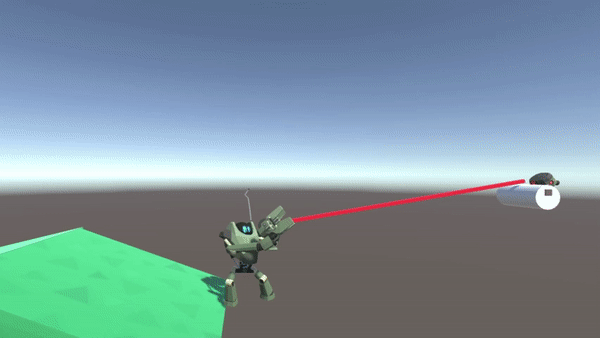

# ChainGun-Prototype
 
 Currently my biggest and most ambitious project. A 2.5D platformer prototype in Unity3D implemented with C#.

 

 Mainly what makes it my most ambitious is thanks to the very sophisticated cable simulation system I'm developing for it. Something I thought I could find ready solutions online somehow turned into my biggest hobby project over all 5 of my years studying. Developing the novel simulation method even became the focus of my master's thesis.

 Although I do have various other features in mind for the game, they'll just have to wait for a bit until I'm done with the cable simulation.

 ## Cables Sim
 For the cable simulation I wanted a robust and efficient way to simulate long 2D cables that could collide and wrap around geometry in the level. I think it would have good potential for puzzle design and an interesting movement option as I wanted it for a grappling hook mechanic. Most grappling hooks in games are kind of mindless, so I wanted this one to be more physically based where you need to be mindful and clever how you use it to climb.

 Turns out that no readily available methods for simulating ropes and wires existed that I thought could suffice. The closest solution I found was a paper by Müller et.al. [Cable 
 Joints](https://matthias-research.github.io/pages/publications/cableJoints.pdf). Their method seemed to be the most robust and efficient when simulating long and load bearing cables. It seemed especially well suited for a 2D implementation too. However, the implemented cable lacks some major behaviors expected by real cables, such as friction and pinching of cables without clipping.

 Both these behaviors I have managed to implement for circular pulleys. The implementation of handling correct pinching behavior is thoroughly explained in my thesis [Pinch Joints](https://www.diva-portal.org/smash/record.jsf?pid=diva2%3A1957835). In the thesis I also present the results of a user study I conducted to see if my contributions give an improvement to the perceived realism of the cable simulation. The results strongly indicate that my method presents an improved visual realism.

 
 *The Main Contribution of the thesis was allowing the cable to maintain its width when pinched by multiple bodies.*

 
 *This rolling transition was not possible before using only [Cable 
 Joints](https://matthias-research.github.io/pages/publications/cableJoints.pdf)*

 
 *Stress test using several stacked pulleys. The compression of the lower pinched cable points is likely caused by the implementation not being directly integrated with the Unity3D physics engine. Something that could be made more robust with a custom engine*

 
 *A demonstration of the friction handling of pinched cables. See how the smaller pulley slowly accelerates the cable which in turn starts slowly accelerating the large pulley through sliding friction.*

Before the cable is ready for the prototype, I need to implement handling of polygon geometries and work on improving the simulation stability a bit. After that I also have some more features in mind to make the segments of cable in between wrapped bodies not just be straight segments.

## Involved Physics Based Player Movement
A huge pillar of this 2.5D platformer is interesting physics-based movement. Most platformers seem to pursue the philosophy of making fast paced and snappy gameplay where exact controls are the most important thing to get down. Therefore, usage of physically based simulation is usually minimal as they can make controls feel floaty and unresponsive. Although I believe that there is still value in more involved physics simulation in making more immersive environments where players can have more freedom in how they interact with their game. If the game is designed to be more slow paced I think it can work just fine.

This involved and immersive physics starts at the most basic level with your character and their movement. You have access to your gun/multitool which you can aim with either the mouse or the right joystick on a controller. Unlike in most games, this thing has actual collision and you can use it as your hand to interact with the environment more intimately. You can use it to grab and manipulate objects in the game, you can use it to climb over ledges, and it can also get you stuck sometimes. 

You need to be more mindful and think about the movement and dimensions of the player character, something you usually don't have to do in games. This is something that can be frustrating in the beginning, but I believe that struggle can result in a more rewarding game. This mechanic and philosophy are inspired by the game Getting Over It with Bennet Foddy. In those games the whole point is the frustration, but for my game I hope to dial that back as much as possible while still maintaining the immersive physicality of the gameplay.

One of the most interesting effects when doing everything physically based are the interesting strategies that can emerge when all mechanics can be seamlessly combined and timed together. For example, the character can crouch and stretch their body. This was originally only meant to allow for the player to more easily manipulate large objects. But the player's upper body has actual mass, and forces are applied to crouch and extend it. The player can perform a simple jump as well at just the press of a button, like in most games. However, if you first crouch, then extend and during the correct timing perform a jump, you will fly much higher. This is not something I consciously programmed into the game, it just happened, and a player should be able to figure this out intuitively as that is how jumping works in real life. I'm excited to see what other emergent mechanics can be found once I add more features.

Now, the next major mechanic to add is the above detailed cable simulation to be used for a grappling hook. I'm excited by the movement and puzzle opportunities that may present themselves with this mechanic.

